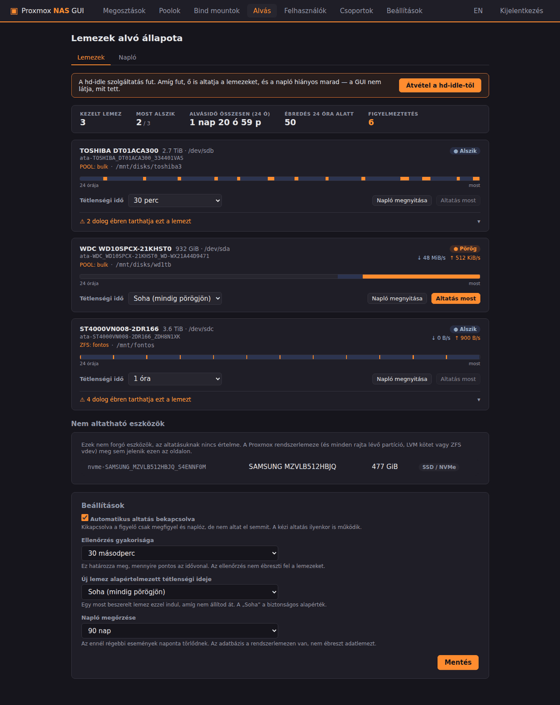
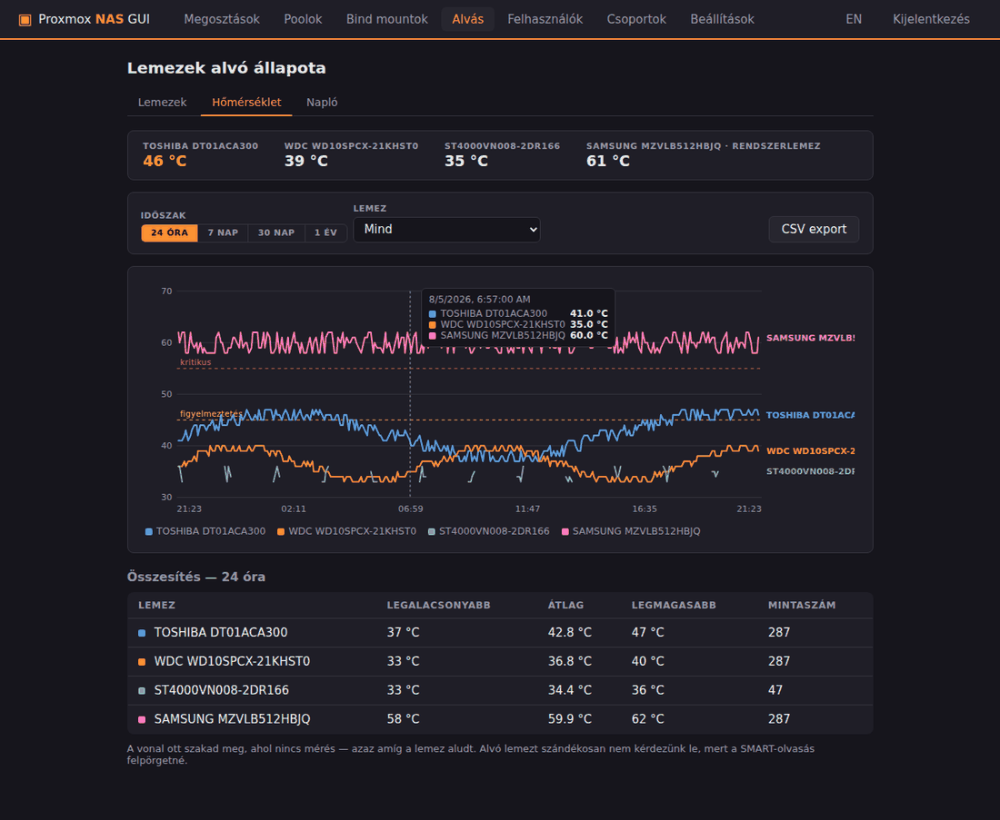
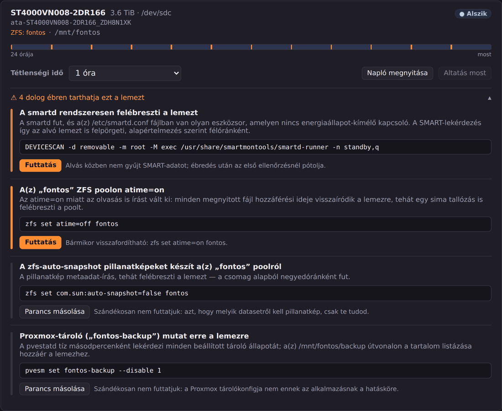
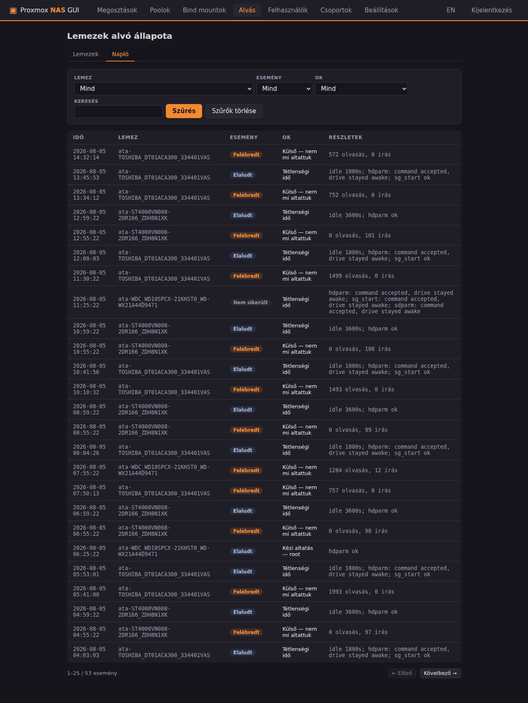

# Proxmox NAS GUI

Unraid-stílusú SMB (Samba) megosztás- és **mergerfs pool**-kezelő webes
felület Proxmox VE-hez. *(English summary below.)*

A Proxmox-ból hiányzik az Unraid kényelmes, kattintható Samba-kezelése. Ez a
projekt ezt pótolja: megosztásokat, felhasználókat és csoportokat hozhatsz
létre pár kattintással, az Unraidből ismert **Export** és **Security**
(Public / Secure / Private) modellel — kiegészítve csoportkezeléssel, amely
az Unraidben nincs is. Emellett [mergerfs](https://github.com/trapexit/mergerfs)
poolokat is kezel: több diszket/mappát fűzhetsz össze egyetlen nagy
fájlrendszerré (mint az Unraid array), és azt azonnal megoszthatod.


## Funkciók

- **Megosztások**: létrehozás/szerkesztés/törlés, útvonal-tallózóval;
  új mappa vagy **ZFS dataset** létrehozása közvetlenül a felületről
- **Export**: `Nem` / `Igen` / `Igen (rejtett)` — a rejtett megosztás működik,
  de nem látszik a hálózat tallózásakor
- **Hálózati böngészés Windows alatt**: a telepítő az `smbd` mellett az
  `nmbd`-t (NetBIOS böngészés) és a `wsdd2`-t (WS-Discovery) is elindítja,
  hogy a gép megjelenjen a Windows Intéző "Hálózat" nézetében — enélkül a
  megosztások `\\<IP>\<megosztás>` útvonallal kézzel elérhetők, csak a
  böngészős lista nem mutatja a gépet
- **Biztonsági módok** (az Unraid pontos megfelelői):
  - **Publikus** — bárki, jelszó nélkül, írás/olvasás
  - **Védett (Secure)** — vendégek olvashatnak, írásjog felhasználónként /
    csoportonként adható (`write list`)
  - **Privát** — csak a kijelölt felhasználók/csoportok
    (`valid users` + `write list`)
- **Felhasználók**: rendszer- + Samba-felhasználó egy lépésben
  (`useradd` + `smbpasswd`), jelszóváltás, törléskor teljes takarítás
- **Csoportok**: POSIX csoportok tagságkezeléssel, a jogosultsági mátrixban
  `@csoport` néven
- **Jogosultsági mátrix mindkét irányból**: a megosztás oldalán a
  felhasználók/csoportok listája, a felhasználó/csoport oldalán a
  megosztások listája — ugyanaz az adat két nézetben
- **Lomtár** megosztásonként (`vfs_recycle`): a hálózatról törölt fájlok a
  `.Recycle.Bin`-be kerülnek, a felületről üríthető
- **Lemezalvás-kezelés**: lemezenként állítható tétlenségi idő, kézi
  altatás, kereshető állapotnapló és figyelmeztetés arról, mi tartja ébren
  az adott lemezt (lásd lentebb)
- **Kétnyelvű felület** (magyar/angol, egy kattintással váltható)
- **PAM bejelentkezés** a hoszt root jelszavával, HTTPS-en

### mergerfs poolok

- **Pool létrehozás/szerkesztés**: branch-ek (diszkek/mappák) hozzáadása
  tallózóval vagy egy kattintással a kezelt diszk-mountokból, branch-enként
  RW / RO (csak olvasás) / NC (nincs új fájl) móddal
- **Diszkek felcsatolása** a felületről: a GUI listázza a fájlrendszerrel
  rendelkező, még nem csatolt partíciókat, és fstab-bejegyzéssel
  a `/mnt/disks/<név>` alá csatolja őket
- **Üres lemezek/partíciók formázása**: a fájlrendszer nélküli eszközök
  külön listában jelennek meg; a felhasználó ext4 vagy xfs fájlrendszert
  választhat, a GUI `wipefs`+`mkfs`-sel formázza (partíciós tábla
  létrehozása nélkül, közvetlenül az eszközre), majd azonnal fel is
  csatolja. A Proxmox rendszerlemez (és minden rajta lévő partíció/LVM
  kötet) sosem jelenik meg egyik listában sem
- **Presetek + haladó mező**: create policy (mfs, epmfs, ff, pfrd, …) rövid
  magyarázatokkal, minimális szabad hely, `moveonenospc`, plusz szabad
  szöveges mező bármely további mergerfs opcióhoz
- **Kihasználtsági nézet**: pool- és branch-enkénti (diszkenkénti)
  tárhely-sávok, mint az Unraid Main füle
- **Élő átkonfigurálás**: felcsatolt pool esetén a branch-lista és a
  beállítások a mergerfs xattr-vezérlőjén át azonnal érvényre jutnak,
  újracsatolás nélkül — Samba-használat közben is bővíthető a pool
- **„Megosztás létrehozása ebből a poolból”** gomb: a share-szerkesztő a
  pool csatolási pontjával előtöltve nyílik
- **Törlésvédelem**: amíg egy megosztás a poolra mutat, a pool nem
  törölhető és nem választható le; pool törlésekor a branch-eken lévő
  adatok érintetlenek maradnak

### Bind mountok — prezentációs fa

A fizikai tárolás és az, amit a felhasználók böngésznek, nem kell, hogy
ugyanaz legyen. Ha a fontos adatok egy ZFS poolon (`/mnt/fontos`), a nem
fontosak meg egy mergerfs poolon (`/mnt/bulk`) vannak, az alapból két külön
csatolási pont, tehát két külön megosztás. Bind mounttal viszont egyetlen
fába fűzhetők:

```
/mnt/fontos/kz  →  /mnt/family_pool/kz/fontos
/mnt/bulk/kz    →  /mnt/family_pool/kz/nemfontos
…
```

Így elég **egyetlen megosztást** kiadni a `/mnt/family_pool`-ra, és a
felhasználó a `kz/fontos`, `kz/nemfontos` szerkezetet látja — miközben a
háttérben a kettő két külön fájlrendszeren ül.

- **Sablon-generátor**: megadod a prezentációs gyökeret, a mappaneveket
  (pl. `kz, kzs, kv`) és a szinteket (`fontos` → `/mnt/fontos`,
  `nemfontos` → `/mnt/bulk`), és a GUI élő előnézettel kiszámolja mind a
  6 bind mountot — jelezve, mely forrásmappák hiányoznak még
- **Hiányzó forrásmappák létrehozása** egy pipával: ZFS dataset alatt
  datasetként, egyébként sima mappaként
- **Fa-nézet**: a logikai szerkezet mellett minden levélnél ott a valós
  forrás és a mögötte lévő tároló (`POOL: bulk`, `fs: /mnt/fontos`)
- **Csak olvasható** bind mount, ha a fát nézegetésre adod ki
- **Törlésvédelem mindkét irányban**: a bind nem törölhető, amíg megosztás
  mutat a céljára, és a pool/diszk sem választható le, amíg egy bind onnan
  veszi a forrását — még akkor sem, ha a megosztás csak a bind célján
  keresztül, közvetve függ tőle

| Megosztás szerkesztése | Felhasználó + jogosultsági mátrix (EN) |
|---|---|
|  |  |

| mergerfs poolok | Pool szerkesztése |
|---|---|
|  |  |

### Lemezek alvó állapota

A Proxmoxból hiányzik az Unraid-szerű lemezalvás-kezelés, a `hd-idle` pedig
kézzel írt konfigot igényel (`/etc/default/hd-idle`), amit lemezcserénél át
kell írni — és csak azt naplózza, amit ő maga altatott el. Ez az oldal
mindhármat kiváltja.

- **Tétlenségi idő lemezenként**, legördülőből: 15/30/45 perc, 1–6 óra, vagy
  „Soha". A beállítás a lemez `/dev/disk/by-id` nevéhez kötődik, nem a
  `/dev/sdX`-hez — az újraindításkor változhat, és akkor egy másik lemezre
  vonatkozna a házirend
- **Kézi altatás** a tétlenségi idő lejárta előtt, egy gombbal
- **Kereshető napló**: minden elalvás és ébredés bekerül egy helyi SQLite
  adatbázisba (`/var/lib/proxmox-nas-gui/disk-events.db`), okkal együtt —
  tétlenségi idő, kézi altatás (a felhasználó nevével), vagy külső. Szűrhető
  lemezre, eseményre, okra és szövegre, lapozva
- **24 órás idővonal** lemezenként, az események átmeneteiből számolva
- **Élő írási/olvasási sebesség** a pörgő lemezeknél, 2 másodpercenként
  frissítve. A számlálók a `/proc/diskstats`-ból jönnek (kernelmemória, nulla
  lemez-I/O), a sebességet a böngésző számolja két minta különbségéből — így
  a lekérdezés maga sosem ébreszt fel semmit, és egy háttérbe tett fül sem
  torzítja az értéket. A szám mellett **tükrözött sparkline** mutatja az
  utolsó 2 percet — az olvasás a középvonal fölött, az írás alatta, közös
  skálán. Így ránézésre elkülönül a löketszerű forgalom (mentés, scrub) az
  egyenletestől, és rögtön látszik az is, ha egy „alvó" lemezre folyamatosan
  írás érkezik
- **Hőmérséklet**: a pörgő lemezeknél az aktuális érték a kártyán, a küszöbök
  szerint színezve; alvó lemeznél az utolsó ismert érték a korával együtt.
  A figyelő 5 percenként mintát vesz és adatbázisba írja, külön
  **Hőmérséklet** fülön grafikonnal (24 óra / 7 nap / 30 nap / 1 év),
  lemezenkénti min–átlag–max táblázattal és CSV exporttal
- **Figyelmeztetések**: a GUI megnézi, mi tarthatja ébren az adott lemezt, és
  ahol biztonságos, egy gombbal ki is javítja



#### Hogyan altat, és miért nem hd-idle-lel?

A `hdparm -y` az ATA STANDBY IMMEDIATE parancsot küldi, amit sok lemez (és
gyakorlatilag minden USB/SAS híd) figyelmen kívül hagy — ráadásul hiba nélkül,
tehát a parancs sikeres kilépése nem bizonyíték. A GUI ezért sorban próbálja a
`hdparm -y` → `sg_start --stop` (SCSI START STOP UNIT) → `sdparm --command=stop`
parancsokat, és **mindegyik után `hdparm -C`-vel ellenőrzi**, hogy a lemez
tényleg készenlétbe került-e. A működő módszert lemezenként megjegyzi, így a
következő altatás már egyetlen parancs.

A tétlenséget a `/proc/diskstats` számlálói adják (kernelmemóriából, nulla
I/O), az energiaállapotot a `hdparm -C` — az ATA CHECK POWER MODE parancsra a
lemez az elektronikájából válaszol, nem pörög fel tőle. **Maga a figyelés
tehát soha nem ébreszti fel a lemezeket.** A figyelő a webalkalmazás
folyamatában fut (egy uvicorn worker), nem külön szolgáltatásként.

Ha a `hd-idle` fut, az oldal tetején figyelmeztetés jelenik meg: amíg fut, ő
is altat, és a napló hiányos marad. Az „Átvétel" gomb leállítja és letiltja,
a `HD_IDLE_OPTS` sorból pedig átveszi a lemezenkénti időzítéseket (a legközelebbi
felkínált értékre kerekítve, amiről jelzést is ad).

#### Hőmérséklet mérése alvó lemez felébresztése nélkül

Ez az egyetlen mérés, ami nem ingyenes: a tétlenség a `/proc/diskstats`-ból,
az energiaállapot a `hdparm -C`-ből jön, de a hőmérséklet valódi
SMART-lekérdezés — pontosan az, amiről a lentebbi `smartd`-figyelmeztetés azt
írja, hogy felpörgeti a lemezt. Ezért két, egymástól független védelem van:

1. **A figyelő csak ébren lévő lemezt kérdez le.** Az energiaállapotot
   ugyanabban a körben már megmérte `hdparm -C`-vel; alvó lemezre a parancsot
   **el sem indítja**.
2. **`smartctl -n standby`** a hálószem, ha a lemez a két lépés között aludt
   el: ilyenkor a smartctl 2-es kóddal kilép anélkül, hogy felpörgetné.

Az adatbázisba **csak valódi mérés** kerül. Egy alvó lemez smartctl-válaszában
a hőmérséklet gyakran `0` — ez „nincs adat", nem fagypont, különben minden
átlagot lehúzna. Ennek szép mellékhatása: **a grafikonon a lyukak maguk az
alvási időszakok**, külön jelölés nélkül látszik, mennyit hűt az altatás.

A rendszerlemez a Hőmérséklet fülön megjelenik (és csak ott): folyamatosan
pörög, tehát tipikusan az a legmelegebb a gépben. Vezérlőt nem kap, és
minden olyan listából kimarad, ami műveletet végezhetne egy lemezen.

#### Mi tartja ébren a lemezt?

Lemezenként az alábbiakat vizsgálja. A ✅ jelölt javítások egy kattintással
lefuttathatók a felületről; a többinél a parancs megjelenik, de szándékosan
nem futtatjuk le — vagy nem ennek az alkalmazásnak a hatásköre, vagy olyan
kompromisszum, amit csak a felhasználó mérlegelhet.

| Ellenőrzés | Miért ébreszt | Javaslat | |
|---|---|---|---|
| `smartd` | 30 percenként SMART-adatot olvas, ami felpörgeti az alvó lemezt | `-n standby,q` a `/etc/smartd.conf` eszközsorára | ✅ |
| ZFS `atime` | `atime=on` mellett az olvasás is írást vált ki | `zfs set atime=off <pool>` | ✅ |
| Csatolási opciók | `relatime` mellett az olvasás is ír a lemezre | `noatime` a GUI saját fstab-sorába + élő remount | ✅ |
| mergerfs gyorsítótár | minden könyvtárlistázás megérinti az összes branch-et | `cache.statfs=60,cache.attr=300,cache.entry=300` | |
| `zfs-auto-snapshot` | negyedóránkénti pillanatkép = metaadat-írás | `zfs set com.sun:auto-snapshot=false <dataset>` | |
| Proxmox-tároló | a `pvestatd` 10 másodpercenként lekérdez minden tárolót | `pvesm set <id> --disable 1` | |
| ZFS scrub | havonta órákra ébren tartja a pool minden lemezét | csak tájékoztatás | |
| ZFS zvol | futó VM/konténer folyamatos I/O-t okoz | csak tájékoztatás | |
| `updatedb` | a napi indexelés végigjárja a fájlrendszert | az útvonal felvétele a `PRUNEPATHS` közé | |

**A mergerFS-ről őszintén:** a mergerfs
[saját dokumentációja](https://github.com/trapexit/mergerfs/wiki/Limit-Drive-Spinup)
kimondja, hogy pool szinten nem lehet megbízhatóan megakadályozni a
felpörgést — a mergerfs proxy, nem gyorsítótár, és egy `readdir` definíció
szerint minden branch-et megérint. A cache-opciók csak az *ismétlődő*
metaadat-kéréseket szűrik. A valódi tanács ezért az, hogy indexelőt,
médiaszervert vagy mentést a mögöttes útvonalra irányíts, ne a poolra.



| Mi tartja ébren? | Állapotnapló |
|---|---|
|  |  |

**A rendszerlemez** — ahogy a formázásnál is — meg sem jelenik az oldalon.
Három szabály zárja ki: a csatolási pont (`/`, `/boot`, LVM-en át is), az
aktív swap, és ZFS-gyökér esetén a `findmnt` + `zpool list` alapján
azonosított pooltagok. Ez utóbbi külön szabály, mert egy `zfs_member`
partíciónak nincs csatolási pontja, tehát az első kettő nem fogná ki.

## Telepítés

Proxmox VE hoszton (vagy bármely Debian-alapú rendszeren, LXC-ben is), rootként:

```bash
git clone https://github.com/kzkz22/proxmox-nas-gui.git
cd proxmox-nas-gui
./deploy/install.sh
```

Ezután a felület a `https://<hoszt-ip>:8481/` címen érhető el, a belépés a
hoszt **root** jelszavával történik. (A tanúsítvány önaláírt, a böngésző
egyszer figyelmeztetni fog.)

## Hogyan működik?

- A beállítások *forrása* a `/etc/proxmox-nas-gui/state.json`, ebből
  generálódik determinisztikusan a `/etc/samba/proxmox-nas-gui.conf`.
- A meglévő `/etc/samba/smb.conf`-ot csak egyetlen `include` sorral egészíti
  ki (az eredetiről biztonsági mentés készül: `smb.conf.pnas-backup`).
- Minden módosítás előtt `testparm` validálja a teljes új konfigurációt egy
  ideiglenes másolaton — hibás beállítás soha nem kerülhet a futó Samba alá.
- Sikeres validálás után újratöltés `smbcontrol all reload-config`-gal,
  újraindítás nélkül.
- A megosztott mappák adatkezelése Unraid-módra történik: a megosztás
  gyökere a `nobody` felhasználóé (`force user = nobody`), a hozzáférést a
  Samba szabályozza — így a jogosultsági mátrix módosítása sosem igényel
  fájlrendszer-szintű chown/chmod futtatást a meglévő fájlokon.
- Megosztás törlésekor **a lemezen lévő adatok érintetlenek maradnak**.
- A mergerfs poolokat generált **systemd unit** indítja
  (`/etc/systemd/system/pnas-pool-<név>.service`, `RequiresMountsFor`-ral a
  helyes boot-sorrendhez) — szándékosan nem fstab-ból, mert a Debian 12-es
  mergerfs 2.33 mount-helpere elutasítja a generikus fstab-opciókat, a
  bináris közvetlen hívása viszont minden verzión működik. Egy hibás pool
  így sosem viszi emergency módba a hosztot.
- A diszk-mountok az `/etc/fstab`-ba kerülnek (`nofail`-lel), soronként
  `# pnas:disk:<név>` címkével — csak a saját sorainkat módosítjuk, az első
  íráskor biztonsági mentés készül (`fstab.pnas-backup`).
- A bind mountok szintén generált **systemd unitot** kapnak
  (`/etc/systemd/system/pnas-bind-<név>.service`), nem fstab-sort. Az fstab
  `x-systemd.requires-mounts-for=` opciója ugyanis egy `.mount` unitra várna,
  a mergerfs poolt viszont egy *service* csatolja — így nincs mire rendezni.
  A unit ezért közvetlenül a pool service-ét nevezi meg
  (`Requires=`/`After=pnas-pool-<név>.service`), minden más forrásnál pedig
  `RequiresMountsFor=` gondoskodik a sorrendről. Leálláskor a systemd
  fordított sorrendben állít, tehát a bind előbb válik le, mint a mögötte
  lévő tároló.
- **A bind unit legfontosabb sora az őrszem**:
  `ExecStartPre=/usr/bin/mountpoint -q <forrás mögötti mount>`. Enélkül egy
  még fel nem csatolt ZFS/mergerfs forrás esetén a `mount --bind` simán
  sikerülne — az alatta lévő **üres** mappára. A Samba ekkor üres megosztást
  adna, egy arra ráállított szinkron-eszköz pedig törlésként propagálhatná az
  ürességet. Az őrszem inkább nem csatol, mint hogy ez megtörténjen.
- Ezért is: a **Syncthingnek (és minden szinkron-eszköznek) a valós
  forrásútvonalat** add meg (`/mnt/fontos/kz`), ne a bind célját. A bind-elt
  fa a Samba (emberi böngészés) kényelmét szolgálja.
- Bind mount törlésekor csak a megjelenítés szűnik meg; a cél mappa üresen
  ottmarad, a forráson lévő adatok érintetlenek.
- A lemezalvás-figyelő a webalkalmazás folyamatában fut, 30 másodpercenként.
  A tétlenséget a `/proc/diskstats` számlálóiból, az energiaállapotot a
  `hdparm -C`-ből olvassa — egyik sem okoz lemez-I/O-t, tehát a figyelés maga
  soha nem ébreszt fel semmit. Az események
  `/var/lib/proxmox-nas-gui/disk-events.db`-be kerülnek (SQLite), ami a
  rendszerlemezen van.
- Az altatási házirendek a `/dev/disk/by-id` névhez kötődnek, nem a
  `/dev/sdX`-hez: az utóbbi felderítési sorrendben kap nevet, tehát
  újraindítás után más lemezre vonatkozhatna ugyanaz a beállítás.

## Konfiguráció (környezeti változók)

| Változó | Alapértelmezés | Leírás |
|---|---|---|
| `PNAS_ADMIN_USERS` | `root` | GUI-ba beléphető rendszerfelhasználók (vesszővel elválasztva) |
| `PNAS_STATE_DIR` | `/etc/proxmox-nas-gui` | A state.json könyvtára |
| `PNAS_SMB_CONF` | `/etc/samba/smb.conf` | A fő Samba konfig |
| `PNAS_GEN_CONF` | `/etc/samba/proxmox-nas-gui.conf` | A generált konfig helye |
| `PNAS_FSTAB` | `/etc/fstab` | A diszk-mountok fstab fájlja |
| `PNAS_SYSTEMD_DIR` | `/etc/systemd/system` | A generált pool-unitok könyvtára |
| `PNAS_LOG_DB` | `/var/lib/proxmox-nas-gui/disk-events.db` | A lemezállapot-napló adatbázisa |
| `PNAS_SMARTD_CONF` | `/etc/smartd.conf` | A smartd konfig (az alvás-ellenőrzéshez) |
| `PNAS_HD_IDLE_CONF` | `/etc/default/hd-idle` | A hd-idle konfig (átvételkor olvassuk) |
| `PNAS_PVE_STORAGE` | `/etc/pve/storage.cfg` | A Proxmox tárolókonfig (csak olvassuk) |
| `PNAS_UPDATEDB_CONF` | `/etc/updatedb.conf` | Az updatedb konfig (csak olvassuk) |
| `PNAS_CRON_DIR` | `/etc/cron.d` | Cron-bejegyzések könyvtára (csak olvassuk) |
| `PNAS_DISABLE_MONITOR` | – | `1` esetén az alvásfigyelő el sem indul (a tesztek ezt használják) |

A hőmérséklet-mérések ugyanabba az adatbázisba kerülnek, mint az
állapotnapló (`PNAS_LOG_DB`), külön táblába és külön megőrzési idővel
(alapból 1 év, szemben a napló 90 napjával).

## Fejlesztés

```bash
python3 -m venv venv && venv/bin/pip install -r backend/requirements-dev.txt
venv/bin/python -m pytest                   # egységtesztek
cd backend && ../venv/bin/uvicorn app.main:app --reload   # dev szerver
```

A `pytest` a repó gyökeréből fut; a `backend/` könyvtárat a `pyproject.toml`
teszi az import útvonalra.

### Felépítés

A kód három részre oszlik, a backendben és a frontenden ugyanúgy:

| | tartalom |
|---|---|
| `core/` | session, `state.json`, parancsfuttatás, mappa-tallózó, i18n, API-kliens |
| `samba/` | megosztások, felhasználók, csoportok, `smb.conf` generálás |
| `storage/` | mergerfs poolok, diszk-mountok, bind mountok, lemezalvás |

**A `samba/` és a `storage/` sosem importálja egymást, és a `core/` egyiket
sem.** Mindkét felet csak a kompozíciós gyökerek látják: `backend/app/models.py`
(a közös `State`), `routes.py`, `state_view.py`, illetve `frontend/main.js` és
`pages.js`. A `tests/test_layering.py` ezt ellenőrzi is.

A két rendszer két ponton találkozik, és mindkettő szándékosan a gyökerekben
él: a `core/deps.blockers_for_path()` mondja meg, hogy egy pool leválasztását
blokkolja-e valamelyik megosztás — a bind mountokat is végigkövetve, mert egy
megosztás a prezentációs fán keresztül közvetve is függhet egy pooltól —, a
pool-mountpointot és bind-célt jelölő badge-et pedig a `main.js` injektálja a
tallózóba.

A csomagokon belül mindenhol ugyanaz a kettősség: a tiszta, alrendszer nélküli
fél (`poolconf.py`, `bindconf.py`, `sambaconf.py`, `sleepconf.py`) egységben
tesztelhető, a valódi eszközökhöz és fájlokhoz nyúló fél (`pools.py`,
`binds.py`, `service.py`, `disksleep.py`) pedig ezekre épül.

Új oldal felvételéhez elég egy leíró a csomag `pages.js`-ébe; a navigáció és a
routing ebből generálódik.

---

## English summary

**Proxmox NAS GUI** is an Unraid-style web UI for managing Samba shares,
users and groups on a Proxmox VE host (or any Debian-based system / LXC).
It reproduces Unraid's Export (`No` / `Yes` / `Yes (hidden)`) and Security
(`Public` / `Secure` / `Private`) model with a per-user/per-group access
matrix, adds group management, a per-share recycle bin (`vfs_recycle`),
directory/ZFS-dataset creation from the browser dialog, PAM (root) login
over HTTPS, a bilingual (Hungarian/English) interface, and starts `nmbd`
and `wsdd2` alongside `smbd` so the host actually shows up in Windows'
Network view instead of only being reachable via a direct UNC path.

It also manages [mergerfs](https://github.com/trapexit/mergerfs) pools:
mount existing partitions from the UI (fstab-based), format blank
disks/partitions (ext4/xfs) that carry no filesystem yet - a disk with no
partition table gets a single GPT partition first, for compatibility if
it's ever moved to another machine - with the Proxmox system disk always
excluded from both lists, build pools from disks/folders with per-branch
RW/RO/NC modes, create-policy
presets plus a free-form advanced options field, per-branch usage bars,
live reconfiguration of mounted pools via the mergerfs xattr control
file, a "create share from this pool" shortcut, and deletion protection
while shares depend on a pool. Pools are started by generated systemd
units (`RequiresMountsFor` ordering) rather than fstab, which works on
both mergerfs 2.33 (Debian 12) and newer.

**Bind mounts** decouple the tree users browse from where the data
actually lives. With important data on a ZFS pool and bulk data on a
mergerfs pool, those are two mountpoints and therefore two shares; bind
mounts weave them into one tree (`/mnt/family_pool/<user>/{fontos,
nemfontos}`) served by a single share. A template generator expands
"presentation root × folder names × tiers" into every bind mount needed,
with a live preview, and can create the missing source directories - as
ZFS datasets where the parent is one. Each bind gets a generated
`pnas-bind-<name>.service`: fstab's `x-systemd.requires-mounts-for=`
would wait on a `.mount` unit, but a mergerfs pool is mounted by a
service, so the unit names that service directly. Its `ExecStartPre`
`mountpoint` check is the part that matters - without it a bind onto a
source whose filesystem is not mounted yet succeeds against the empty
directory underneath, and Samba serves that emptiness. Point Syncthing
and other sync tools at the real source path, never at a bind target.

Install as root: `./deploy/install.sh`, then open `https://<host>:8481/`.
Configuration lives in `/etc/proxmox-nas-gui/state.json`; the generated
Samba config is validated with `testparm` before every apply, and the
existing `smb.conf` is only extended with a single `include` line.
