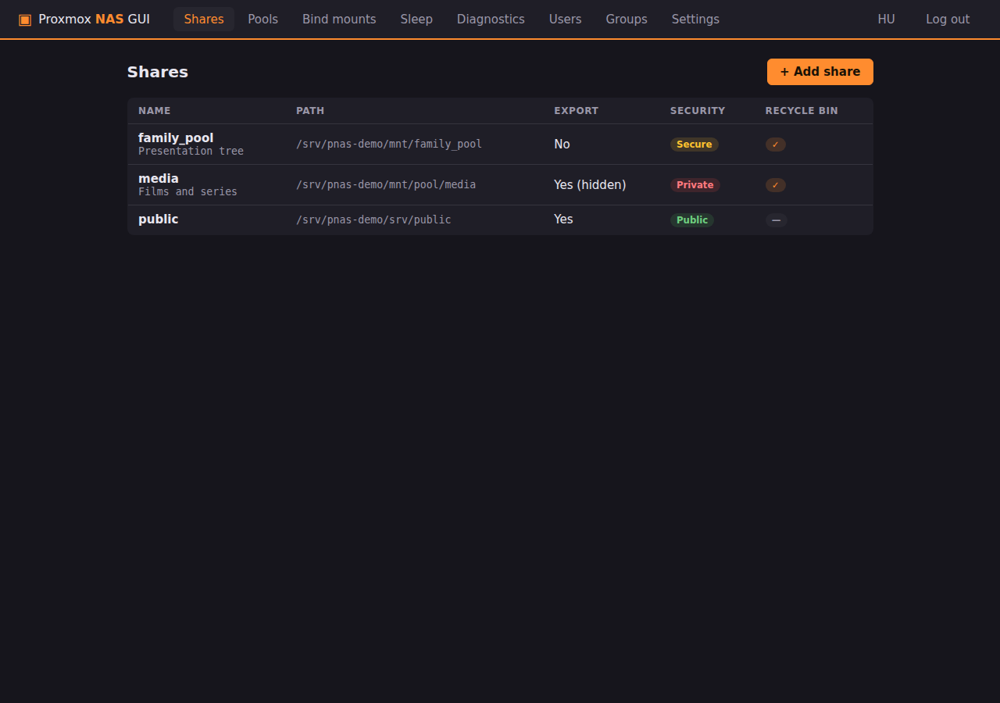
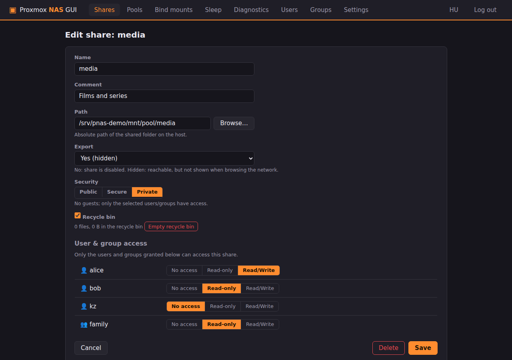
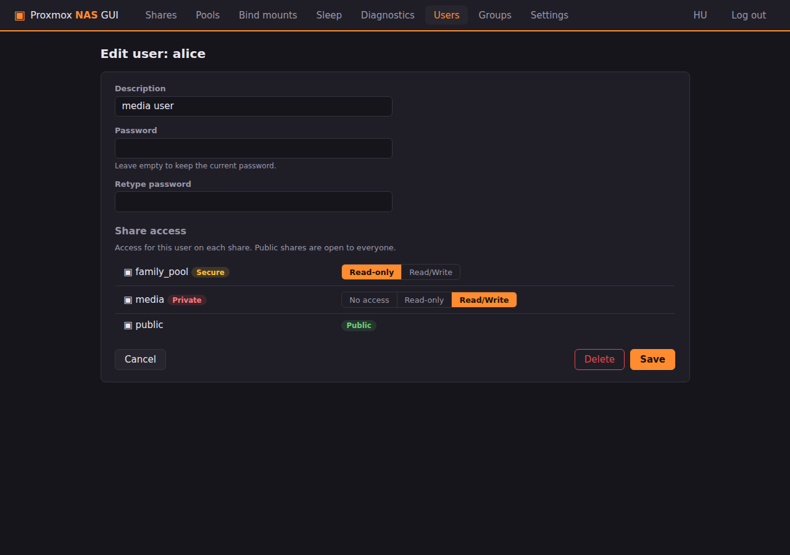
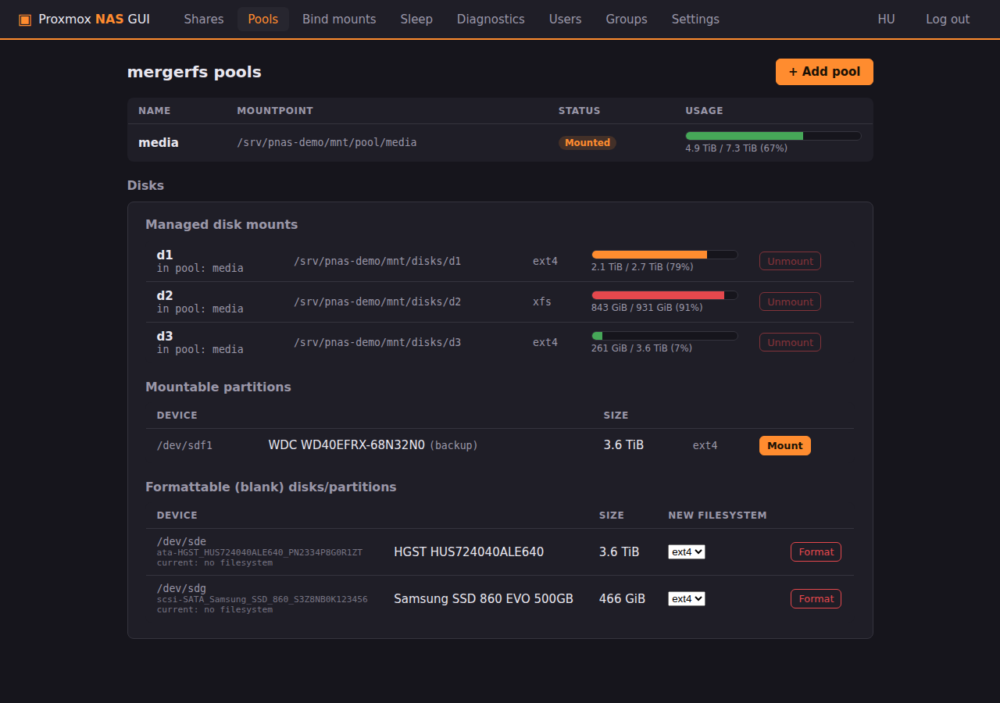
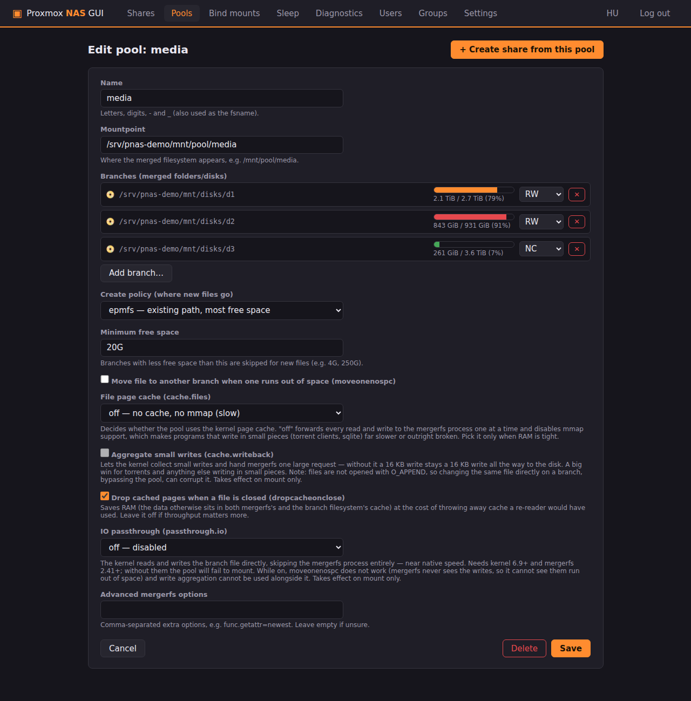
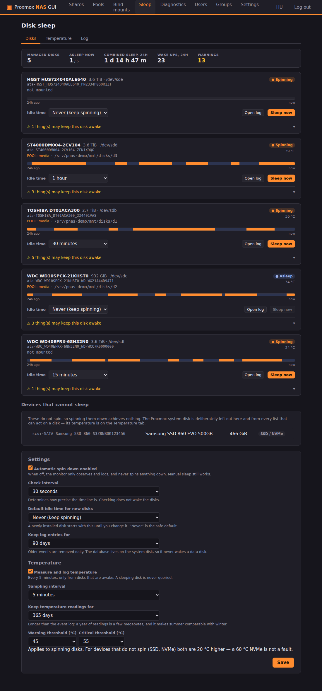
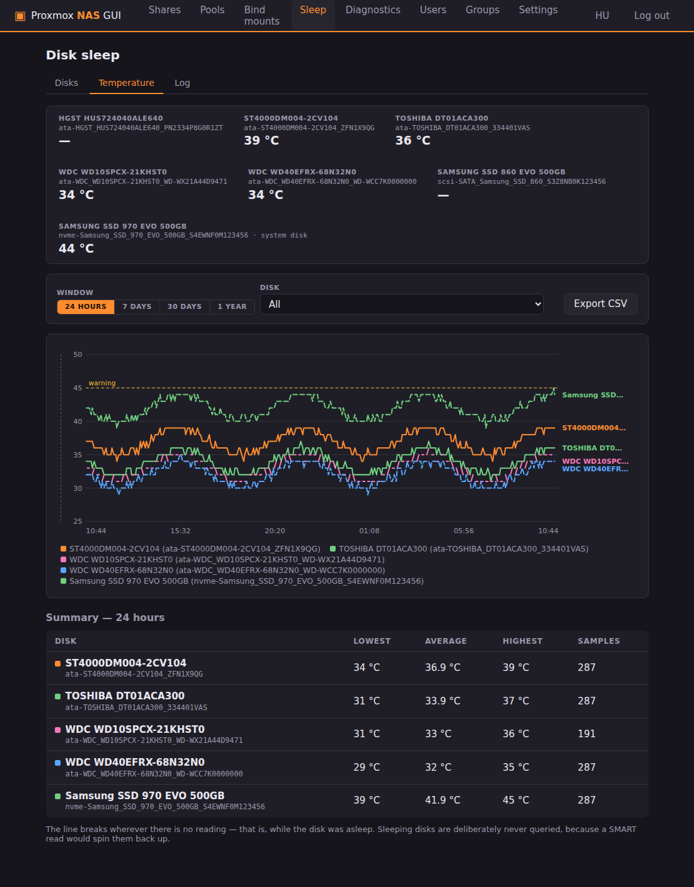
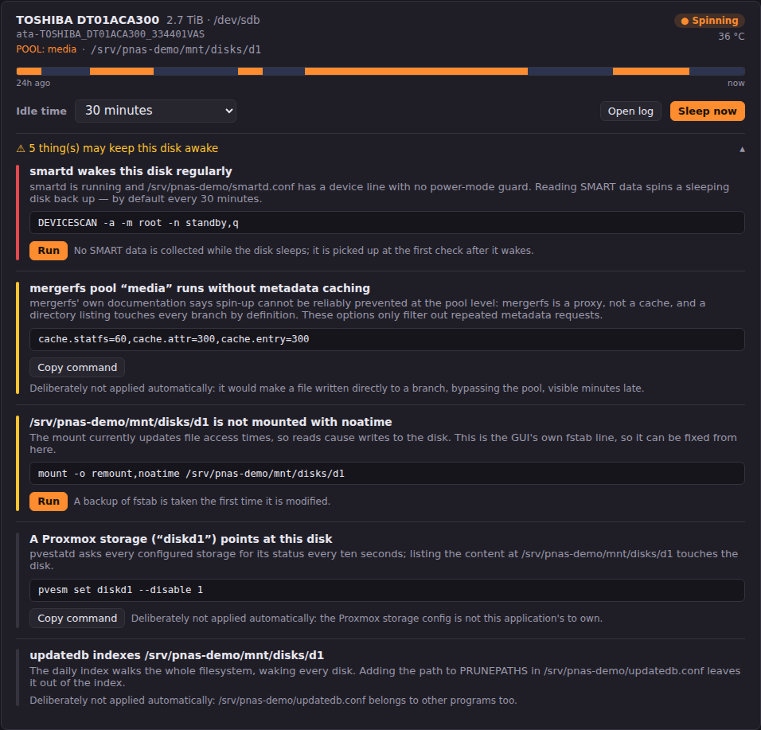
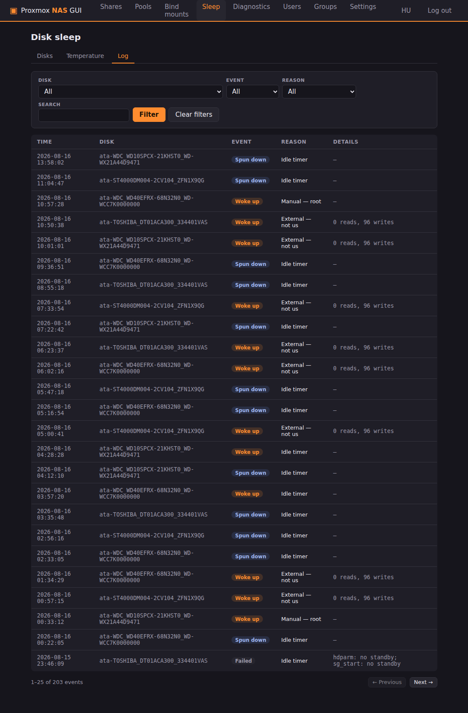
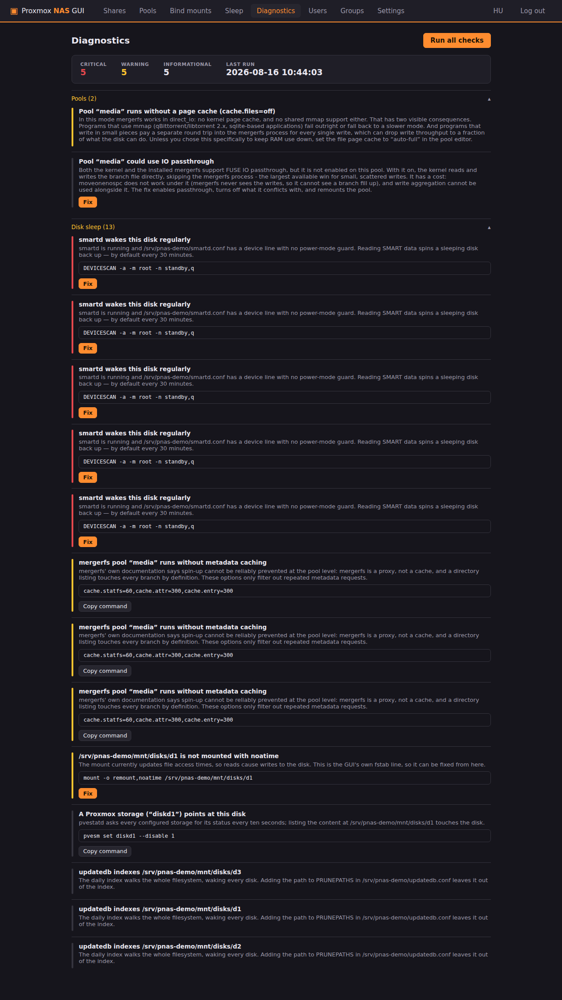

# Proxmox NAS GUI
AI-generated code!

🇭🇺 Magyar leírás: [README.hu.md](README.hu.md)

An Unraid-style SMB (Samba) share and **mergerfs pool** manager, as a web
UI, for Proxmox VE.

Proxmox has nothing like Unraid's convenient, click-to-configure Samba
management. This project fills that gap: create shares, users and groups in
a few clicks, with the same **Export** and **Security** (Public / Secure /
Private) model Unraid uses — plus group management, which Unraid itself
doesn't have. It also manages [mergerfs](https://github.com/trapexit/mergerfs)
pools: combine several disks/folders into one large filesystem (like the
Unraid array), and share it immediately.



## Features

- **Shares**: create/edit/delete, with a path browser; create a new folder or
  a **ZFS dataset** directly from the UI
- **Export**: `No` / `Yes` / `Yes (hidden)` — a hidden share still works, it
  just doesn't show up when browsing the network
- **Network browsing on Windows**: the installer starts `nmbd` (NetBIOS
  browsing) and `wsdd2` (WS-Discovery) alongside `smbd`, so the host actually
  shows up in Windows Explorer's "Network" view — without them the shares are
  still reachable by typing `\\<IP>\<share>`, they just don't appear in the
  browse list
- **Security modes** (exact equivalents of Unraid's):
  - **Public** — anyone, no password, read/write
  - **Secure** — guests can read, write access is granted per user/group
    (`write list`)
  - **Private** — only the selected users/groups (`valid users` + `write list`)
- **Users**: system + Samba account in one step (`useradd` + `smbpasswd`),
  password changes, full cleanup on deletion
- **Groups**: POSIX groups with membership management, shown as `@group` in
  the access matrix
- **Access matrix from both directions**: the list of users/groups on a
  share's page, the list of shares on a user's/group's page — same data, two
  views
- **Per-share recycle bin** (`vfs_recycle`): files deleted over the network go
  into `.Recycle.Bin`, emptyable from the UI
- **Disk sleep management**: per-disk idle timeout, manual spin-down, a
  searchable state log, and a warning about what is keeping a given disk
  awake (see below)
- **Bilingual interface** (Hungarian/English, switchable with one click)
- **PAM login** with the host's root password, over HTTPS

### mergerfs pools

- **Pool create/edit**: add branches (disks/folders) with a browser or with
  one click from the managed disk mounts, per-branch RW / RO (read-only) /
  NC (no new files) mode
- **Mount disks from the UI**: the GUI lists partitions that have a
  filesystem but aren't mounted yet, and mounts them under `/mnt/disks/<name>`
  with an fstab entry
- **Format blank disks/partitions**: devices with no filesystem show up in
  their own list; pick ext4 or xfs and the GUI formats them with
  `wipefs`+`mkfs`, then mounts the result immediately. A whole blank *disk*
  gets a GPT label with one full-size partition first, and it is that
  partition (`/dev/sdX1`) that is formatted and mounted — a bare filesystem
  on the disk device works for mergerfs but confuses other tools and
  operating systems if the disk is ever moved. An already-partitioned device
  is formatted in place, with no repartitioning. The Proxmox system disk (and
  every partition/LVM volume on it) never appears in either list
- **Presets plus an advanced field**: create policy (mfs, epmfs, ff, pfrd, …)
  with short explanations, minimum free space, `moveonenospc`, plus a
  free-form text field for any other mergerfs option
- **Cache settings as their own fields**, because they decide write
  throughput: `cache.files` (defaults to `auto-full`), `cache.writeback`
  (coalesces small writes) and `dropcacheonclose`. `cache.files=off` means
  direct_io — no page cache and no shared mmap, which makes mmap-using
  programs (qBittorrent/libtorrent 2.x, sqlite) fail outright, and reduces
  small-write throughput to a fraction of what the disk can do. Diagnostics
  warns separately if a pool is running that way
- **IO passthrough**: if both the kernel (6.9+) and mergerfs (2.41+) support
  it, `passthrough.io` skips the mergerfs process entirely and reads/writes
  at near-native speed. Diagnostics notices when it's available and can turn
  it on with one click — disabling the settings it conflicts with
  (moveonenospc, write coalescing) and remounting the pool
- **Usage view**: per-pool and per-branch (per-disk) storage bars, like
  Unraid's Main tab
- **Live reconfiguration**: for a mounted pool, the branch list and settings
  take effect immediately through mergerfs's xattr control file, no remount
  needed — a pool can grow even while Samba is using it. Options typed into
  the advanced field are applied live too, and only the ones the running
  mergerfs actually refused are reported back
- **Offered remount**: when a setting can only be read at mount time
  (`cache.writeback`, `passthrough`), the GUI asks after saving whether to
  remount the pool — and if so, brings the bind mounts on top of it back up
- **"Create share from this pool" button**: opens the share editor
  pre-filled with the pool's mountpoint
- **Deletion protection**: a pool can't be deleted or unmounted while a share
  points at it; deleting a pool leaves the data on its branches untouched

### Bind mounts — a presentation tree

Physical storage and what users browse don't have to be the same thing. If
important data lives on a ZFS pool (`/mnt/important`) and less important data
on a mergerfs pool (`/mnt/bulk`), those are two separate mountpoints by
default — and therefore two separate shares. A bind mount weaves them into a
single tree instead:

```
/mnt/important/kz  →  /mnt/family_pool/kz/important
/mnt/bulk/kz       →  /mnt/family_pool/kz/other
…
```

That way a **single share** on `/mnt/family_pool` is enough, and the user
sees a `kz/important`, `kz/other` structure — while behind the scenes the two
live on two different filesystems.

- **Template generator**: give it the presentation root, the folder names
  (e.g. `kz, kzs, kv`) and the tiers (`important` → `/mnt/important`, `other`
  → `/mnt/bulk`), and the GUI computes all 6 bind mounts with a live preview
  — flagging which source folders are still missing
- **Create missing source folders** with one checkbox: as a ZFS dataset if
  the parent is one, otherwise as a plain folder
- **Tree view**: alongside the logical structure, every leaf shows the real
  source and the storage behind it (`POOL: bulk`, `fs: /mnt/important`)
- **Read-only** bind mount, if you're exposing the tree for browsing only
- **Deletion protection in both directions**: a bind can't be deleted while a
  share points at its target, and a pool/disk can't be unmounted while a bind
  sources from it — even if a share only depends on it indirectly, through the
  bind's target

| Editing a share | User + access matrix (EN) |
|---|---|
|  |  |

| mergerfs pools | Editing a pool |
|---|---|
|  |  |

### Disk sleep

Proxmox has no Unraid-style disk sleep management, and `hd-idle` needs a
hand-edited config (`/etc/default/hd-idle`) that has to be rewritten whenever
a disk is swapped — and it only logs the spin-downs it performed itself. This
page replaces all three.

- **Per-disk idle timeout**, from a dropdown: 15/30/45 minutes, 1–6 hours, or
  "Never". The setting is tied to the disk's `/dev/disk/by-id` name, not
  `/dev/sdX` — the latter can change on reboot, and then the policy would
  apply to a different disk
- **Manual spin-down** before the idle timer expires, with one click
- **Searchable log**: every sleep and wake event goes into a local SQLite
  database (`/var/lib/proxmox-nas-gui/disk-events.db`), together with why —
  idle timeout, manual spin-down (with the user's name), or external.
  Filterable by disk, event, reason and free text, with paging
- **24-hour timeline** per disk, computed from the events' transitions
- **Live read/write throughput** for spinning disks, refreshed every 2
  seconds. The counters come from `/proc/diskstats` (kernel memory, zero disk
  I/O), and the rate is computed by the browser from the difference between
  two samples — so polling itself never wakes anything, and a backgrounded
  tab doesn't skew the value either. Next to the number, a **mirrored
  sparkline** shows the last 2 minutes — reads above the centre line, writes
  below, on a shared scale. That makes bursty traffic (a save, a scrub) stand
  out from steady traffic at a glance, and immediately shows if a "sleeping"
  disk is being written to continuously
- **Temperature**: the current value on the card for spinning disks, coloured
  by threshold; for a sleeping disk, the last known value with its age. The
  monitor samples every 5 minutes and writes to the database, with its own
  **Temperature** tab showing a chart (24h / 7d / 30d / 1y), a per-disk
  min–average–max table, and CSV export
- **Warnings**: the GUI checks what might be keeping a given disk awake, and
  fixes it with one click wherever that's safe



#### How it puts disks to sleep, and why not just hd-idle?

`hdparm -y` sends the ATA STANDBY IMMEDIATE command, which plenty of drives
(and virtually every USB/SAS bridge) ignore — and without an error, so the
command exiting successfully proves nothing. The GUI therefore tries
`hdparm -y` → `sg_start --stop` (SCSI START STOP UNIT) → `sdparm --command=stop`
in order, **verifying with `hdparm -C` after each one** that the disk
actually reached standby. It remembers which method worked per disk, so the
next spin-down is a single command.

Idleness comes from `/proc/diskstats` counters (kernel memory, zero I/O), and
power state from `hdparm -C` — ATA CHECK POWER MODE, answered by the drive's
electronics without spinning it up. **So monitoring itself never wakes a
disk.** The monitor runs inside the web application's own process (one
uvicorn worker), not as a separate service.

If `hd-idle` is running, a warning banner appears at the top of the page:
while it's running, it's also putting disks to sleep, and the log stays
incomplete. The "Take over" button stops and disables it, and imports the
per-disk timings from the `HD_IDLE_OPTS` line (rounded to the nearest offered
value, which it reports).

#### Measuring temperature without waking a sleeping disk

This is the one measurement that isn't free: idleness comes from
`/proc/diskstats`, power state from `hdparm -C`, but temperature is a real
SMART query — exactly what the `smartd` warning further down says spins a
disk up. So there are two independent safeguards:

1. **The monitor only queries a disk it has just observed to be awake.** It
   already measured the power state this same round with `hdparm -C`; it
   never even issues the command against a sleeping disk.
2. **`smartctl -n standby`** is the safety net for the case where the disk
   fell asleep between those two steps: smartctl then exits with code 2
   without spinning it up.

**Only a real measurement** ever goes into the database. A sleeping disk's
smartctl response often reports `0` for temperature — that's treated as "no
reading", not freezing, or it would drag every average down. A nice side
effect: **the gaps on the chart are the sleep periods themselves**, no
separate marker needed to see how much cooler sleep makes things.

The system disk appears on the Temperature tab (and only there): it spins
continuously, so it's typically the warmest drive in the box. It gets no
controls, and stays out of every list that could act on a disk.

#### What's keeping a disk awake?

Per disk, the GUI checks the following. Checks marked ✅ can be fixed with one
click from the UI; for the rest, the command is shown but deliberately not
run — either it's outside this application's remit, or it's a trade-off only
the user can weigh.

| Check | Why it wakes the disk | Suggestion | |
|---|---|---|---|
| `smartd` | Reads SMART data every 30 minutes, which spins up a sleeping disk | `-n standby,q` on the device line in `/etc/smartd.conf` | ✅ |
| ZFS `atime` | With `atime=on`, even a read triggers a write | `zfs set atime=off <pool>` | ✅ |
| Mount options | With `relatime`, even a read writes to the disk | `noatime` on the GUI's own fstab line + a live remount | ✅ |
| mergerfs cache | Every directory listing touches all branches | `cache.statfs=60,cache.attr=300,cache.entry=300` | |
| `zfs-auto-snapshot` | A snapshot every 15 minutes is a metadata write | `zfs set com.sun:auto-snapshot=false <dataset>` | |
| Proxmox storage | `pvestatd` queries every configured storage every 10 seconds | `pvesm set <id> --disable 1` | |
| ZFS scrub | Keeps every disk in the pool awake for hours, monthly | informational only | |
| ZFS zvol | A running VM/container causes continuous I/O | informational only | |
| `updatedb` | The daily index walks the whole filesystem | add the path to `PRUNEPATHS` | |

**Honestly, about mergerfs:** mergerfs's
[own documentation](https://github.com/trapexit/mergerfs/wiki/Limit-Drive-Spinup)
says spin-up cannot be reliably prevented at the pool level — mergerfs is a
proxy, not a cache, and a `readdir` by definition touches every branch. The
cache options only filter out *repeated* metadata requests. The real advice
is to point an indexer, media server or backup tool at the underlying path,
never at the pool.



| What's keeping this disk awake? | State log |
|---|---|
|  |  |

**The system disk** — like at format time — doesn't appear on this page at
all. Three rules exclude it: the mountpoint (`/`, `/boot`, through LVM too),
active swap, and for a ZFS root, membership identified via `findmnt` +
`zpool list`. The last one is its own rule because a `zfs_member` partition
has no mountpoint at all, so the first two wouldn't catch it.

### Diagnostics

One button runs every check across the pools, bind mounts, shares, disk
mounts, systemd units and disk sleep. Whatever can be fixed safely, a button
fixes; for everything else, a copyable command is shown.

The performance-related checks, because these don't show up as errors, only
as slowness:

- **`cache.files=off`**: the pool is running without a page cache, which
  removes mmap support and turns every small write into its own round trip
- **The running mount doesn't match what's saved**: some mergerfs options
  (write coalescing, passthrough) can only be picked up at mount time, so
  saving alone isn't enough. This check compares the *actually running*
  values, via the mergerfs xattr control file, against what's saved — the fix
  remounts the pool and brings its bind mounts back up (they go down with the
  pool when it stops)
- **Outdated mergerfs**: the kernel could do IO passthrough, but the
  installed mergerfs can't. The distro package tends to lag years behind
- **IO passthrough available**: everything needed is present, but it isn't
  turned on for the pool. The fix turns it on, turns off what conflicts with
  it (moveonenospc, write coalescing), and remounts



## Installation

On a Proxmox VE host (or any Debian-based system, including inside an LXC),
as root:

```bash
git clone https://github.com/kzkz22/proxmox-nas-gui.git
cd proxmox-nas-gui
./deploy/install.sh
```

The UI is then available at `https://<host-ip>:8481/`, logging in with the
host's **root** password. (The certificate is self-signed; the browser will
warn once.)

The installer installs mergerfs from apt, then — if the distro's package is
older — overwrites it with the upstream release. Debian's package lags years
behind (bookworm: 2.33.5, trixie: 2.40.2), and what's missing matters:
`passthrough.io` arrived in 2.41.0. mergerfs's own documentation also
recommends installing from the releases page. If there's no network, or no
build for the given distro, the apt version is kept and installation
continues.

### Upgrade note: pool cache defaults changed

Previously the GUI mounted every pool with fixed
`cache.files=off,dropcacheonclose=true` options. That forces direct_io: no
page cache, and FUSE can't offer shared mmap either — so every mmap-using
program failed with `ENODEV`, and small-write programs (torrent clients) were
stuck at a fraction of the disk's throughput. The default is now
`cache.files=auto-full`, `dropcacheonclose=false`, `cache.writeback=false`.

Existing pools keep their saved settings, but if these three fields were
never stored, they now get the new default, which takes effect the next time
the pool is saved or remounted. If the old behaviour is needed (e.g. on very
little RAM), the file cache can be set back to `off` in the pool editor.

## How it works

- The *source of truth* for configuration is
  `/etc/proxmox-nas-gui/state.json`, from which
  `/etc/samba/proxmox-nas-gui.conf` is generated deterministically.
- The existing `/etc/samba/smb.conf` is only extended with a single `include`
  line (the original is backed up as `smb.conf.pnas-backup`).
- Before every change, `testparm` validates the entire new configuration on a
  temporary copy — an invalid configuration can never reach the running
  Samba.
- After successful validation, a reload happens via
  `smbcontrol all reload-config`, with no restart.
- Shared folders are managed the Unraid way: the share's root is owned by
  `nobody` (`force user = nobody`), and Samba enforces access — so editing
  the access matrix never requires a filesystem-level chown/chmod on existing
  files.
- Deleting a share **leaves the data on disk untouched**.
- mergerfs pools are started by a generated **systemd unit**
  (`/etc/systemd/system/pnas-pool-<name>.service`, with `RequiresMountsFor`
  for correct boot ordering) — deliberately not from fstab, because Debian
  12's mergerfs 2.33 mount helper rejects generic fstab options, while
  calling the binary directly works on every version. A broken pool can
  therefore never drop the host into emergency mode.
- Disk mounts go into `/etc/fstab` (with `nofail`), each line tagged
  `# pnas:disk:<name>` — only our own lines are ever touched, and a backup
  (`fstab.pnas-backup`) is made on the first write.
- Bind mounts also get a generated **systemd unit**
  (`/etc/systemd/system/pnas-bind-<name>.service`), not an fstab line.
  fstab's `x-systemd.requires-mounts-for=` option would wait on a `.mount`
  unit, but a mergerfs pool is mounted by a *service* — so there's nothing to
  order against. The unit therefore names the pool service directly
  (`Requires=`/`After=pnas-pool-<name>.service`); every other source is
  ordered with `RequiresMountsFor=`. On shutdown, systemd stops things in
  reverse order, so a bind comes down before the storage behind it.
- **The most important line in a bind unit is the guard**:
  `ExecStartPre=/usr/bin/mountpoint -q <mount behind the source>`. Without it,
  a `mount --bind` onto a not-yet-mounted ZFS/mergerfs source would simply
  succeed — against the **empty** directory underneath. Samba would then
  serve an empty share, and a sync tool pointed at it could propagate the
  emptiness as deletions. The guard would rather not mount at all than let
  that happen.
- Which is also why: **point Syncthing (and any sync tool) at the real source
  path** (`/mnt/important/kz`), never at a bind's target. The bound tree
  exists for Samba's (human browsing) convenience.
- Deleting a bind mount only removes the presentation; the target folder is
  left empty, and the data at the source is untouched.
- The disk sleep monitor runs inside the web application's process, every 30
  seconds. It reads idleness from `/proc/diskstats` counters and power state
  from `hdparm -C` — neither causes disk I/O, so monitoring itself never
  wakes anything. Events go into
  `/var/lib/proxmox-nas-gui/disk-events.db` (SQLite), which lives on the
  system disk.
- Sleep policies are tied to the `/dev/disk/by-id` name, not `/dev/sdX`: the
  latter is assigned in discovery order, so after a reboot the same setting
  could apply to a different disk.

## Security model

What this tool is, stated plainly, because several of the design decisions
below only make sense once it is: a single-administrator management console
for one host, on a trusted network. It is not multi-tenant, and it draws no
line between "logged in" and "allowed to do this".

**Signing in is equivalent to root on the host.** Authentication goes through
PAM against a real system account — by default `root`, the host's own
password. Anyone who gets past the login screen can format disks, edit
`/etc/fstab`, write systemd units and restart services. There are no
permission levels inside the application, and adding one would be
security theatre: every feature it offers is a root operation.

**Sign-in attempts are throttled.** Five failed attempts per (address,
username) pair are free; from the sixth, the wait doubles from 30 seconds up
to a 15-minute cap, and a second counter per source address stops the count
being reset by trying a different username each time. A locked-out caller is
refused even with the correct password. Failures are logged with the username
and source address, so `journalctl -u proxmox-nas-gui` is greppable and
fail2ban has something to match. The counters live in memory and a service
restart clears them.

**Cross-site requests are refused twice over.** The session cookie is
`SameSite=Lax`, so a browser will not attach it to a cross-site write in the
first place. On top of that, every `POST`/`PUT`/`PATCH`/`DELETE` is checked:
if the request carries an `Origin` header that does not match the host it was
sent to, it is refused with a 403 before the session is even looked at. Reads
are exempt — nothing here changes state on a `GET`. Requests with no `Origin`
at all are allowed, so `curl` and scripts keep working; a page mounting a CSRF
attack cannot suppress that header, so its absence is not a case the attack
can arrange. Behind a reverse proxy that serves the UI under a different name
than it forwards, list the public origin in `PNAS_TRUSTED_ORIGINS`.

**Sessions live in memory.** The session cookie is `HttpOnly`, `Secure` and
`SameSite=Lax`; the token behind it is kept in a dictionary in the running
process, not on disk. This follows from the single-worker deployment: a
service restart signs everybody out, which is the accepted cost of never
writing a session token to disk and of not needing a shared session store.
Running more than one worker would break sessions and is not supported.

**Share directories are world-accessible on the host.** Shares are set up the
way Unraid does it: the share root is `nobody:nogroup` and `0777`, and the
generated Samba config uses `force user = nobody` with `create mask = 0666`
and `directory mask = 0777`. Every file in a share therefore belongs to
`nobody` and is readable and writable by any local account on the host. This
is what makes the access matrix work — permissions are decided by Samba at
connection time, once, rather than by chown runs across the data. **The
consequence is explicit: the per-user and per-group settings in this GUI
control SMB access only. They are not a protection against anything with
local filesystem access to the host** — another shell account, a container or
VM with a bind mount of the path, or a backup job. On a Proxmox host that
usually means root and nothing else, which is why this trade-off is
acceptable here; if it isn't in your setup, the share paths need protecting
at the host level, not in this GUI.

**The service runs as root, without systemd sandboxing.** It mounts and
unmounts filesystems, formats disks, writes into `/etc/fstab`, `/etc/samba`
and `/etc/systemd/system`, and drives `systemctl` and `smbpasswd` — so
`ProtectSystem` and friends would have to be opened back up for exactly the
paths that matter. `PrivateTmp` is worse than useless here: it puts the
service in its own mount namespace, and the application mounts disks from its
own process, so the mounts would become invisible to the rest of the host.
The trade-off is accepted rather than overlooked, and the practical
consequence is that any bug in this application is a host-level bug.

**Keep it off the internet.** The service listens on `0.0.0.0:8481` with a
self-signed certificate. It is meant to be reached from a LAN or over a VPN.
Exposing the port publicly puts an unattended root PAM login on the internet;
if you must, put it behind a reverse proxy that does its own authentication
and rate limiting, and restrict the source addresses at the firewall.

## Configuration (environment variables)

| Variable | Default | Description |
|---|---|---|
| `PNAS_ADMIN_USERS` | `root` | System users allowed to log into the GUI (comma-separated) |
| `PNAS_TRUSTED_ORIGINS` | – | Extra origins accepted for state-changing requests, e.g. `https://nas.example.com` (comma-separated). Only needed behind a reverse proxy that serves the UI under a different name than it forwards |
| `PNAS_STATE_DIR` | `/etc/proxmox-nas-gui` | Directory for state.json |
| `PNAS_SMB_CONF` | `/etc/samba/smb.conf` | The main Samba config |
| `PNAS_GEN_CONF` | `/etc/samba/proxmox-nas-gui.conf` | Where the generated config is written |
| `PNAS_FSTAB` | `/etc/fstab` | The fstab file for disk mounts |
| `PNAS_SYSTEMD_DIR` | `/etc/systemd/system` | Directory for generated pool units |
| `PNAS_LOG_DB` | `/var/lib/proxmox-nas-gui/disk-events.db` | The disk-state log database |
| `PNAS_SMARTD_CONF` | `/etc/smartd.conf` | The smartd config (for the sleep check) |
| `PNAS_HD_IDLE_CONF` | `/etc/default/hd-idle` | The hd-idle config (read on takeover) |
| `PNAS_PVE_STORAGE` | `/etc/pve/storage.cfg` | The Proxmox storage config (read-only) |
| `PNAS_UPDATEDB_CONF` | `/etc/updatedb.conf` | The updatedb config (read-only) |
| `PNAS_CRON_DIR` | `/etc/cron.d` | Directory for cron entries (read-only) |
| `PNAS_DISABLE_MONITOR` | – | `1` disables the sleep monitor entirely (used by the tests) |

Temperature readings go into the same database as the state log
(`PNAS_LOG_DB`), in a separate table with its own retention (1 year by
default, versus the log's 90 days).

## Development

```bash
python3 -m venv venv && venv/bin/pip install -r backend/requirements-dev.txt
venv/bin/python -m pytest                   # unit tests
cd backend && ../venv/bin/uvicorn app.main:app --reload   # dev server
```

`pytest` runs from the repo root; `pyproject.toml` puts `backend/` on the
import path.

### Dependency versions

`backend/requirements.txt` pins exact versions rather than floors. The
installer runs `pip` as root on a live host, so "whatever is newest today"
would decide what a root-running service is built from — and it had already
drifted once: a `fastapi>=0.110` floor was resolving to a Starlette that had
gone 1.x. `starlette` and `pydantic` are pinned too even though nothing
imports them directly, because FastAPI asks for them without an upper bound,
so a major release of either arrives without FastAPI changing at all.

To update: resolve and install into a fresh venv, run the full suite, then
change the versions in one commit. Two limits worth stating — this is
installation determinism, not a lockfile (the rest of the transitive graph
still floats and nothing is hash-verified), and pinned versions do not pick up
upstream security fixes on their own, so the update is a task rather than a
side effect.

### Structure

The code splits into three parts, the same way in the backend and the
frontend:

| | contains |
|---|---|
| `core/` | session, `state.json`, running commands, directory browser, i18n, API client |
| `samba/` | shares, users, groups, `smb.conf` generation |
| `storage/` | mergerfs pools, disk mounts, bind mounts, disk sleep |

**`samba/` and `storage/` never import each other, and `core/` imports
neither.** Both sides are only seen by the composition roots:
`backend/app/models.py` (the shared `State`), `routes.py`, `state_view.py`,
and `frontend/main.js` / `pages.js`. `tests/test_layering.py` enforces this.

The two systems meet at exactly two points, and both deliberately live in the
roots: `core/deps.blockers_for_path()` answers whether unmounting a pool is
blocked by a share — following bind mounts too, since a share can depend on a
pool indirectly through the presentation tree — and the badge marking a pool
mountpoint or bind target is injected into the browser by `main.js`.

The same duality repeats inside each package: the pure, subsystem-free half
(`poolconf.py`, `bindconf.py`, `sambaconf.py`, `sleepconf.py`) is unit-tested
in isolation, and the half that touches real devices and files
(`pools.py`, `binds.py`, `service.py`, `disksleep.py`) builds on it.

Adding a new page only needs a descriptor in the package's `pages.js`; the
navigation and routing are generated from that.
