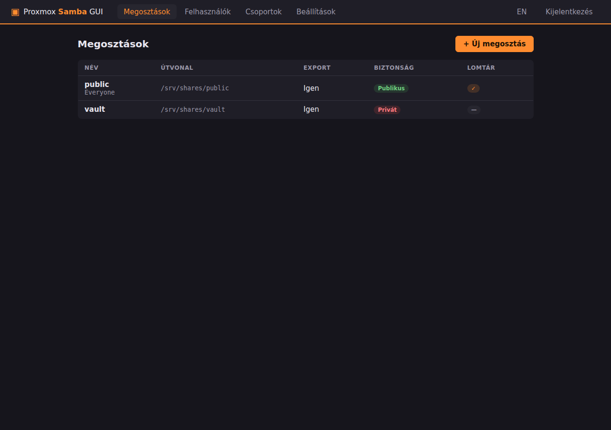
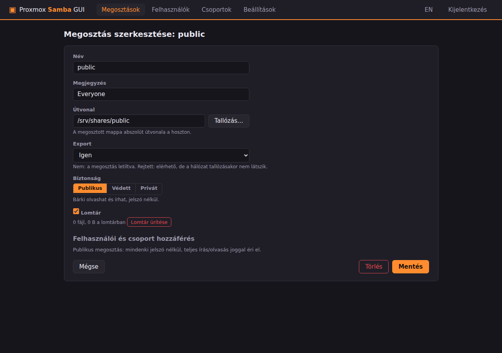
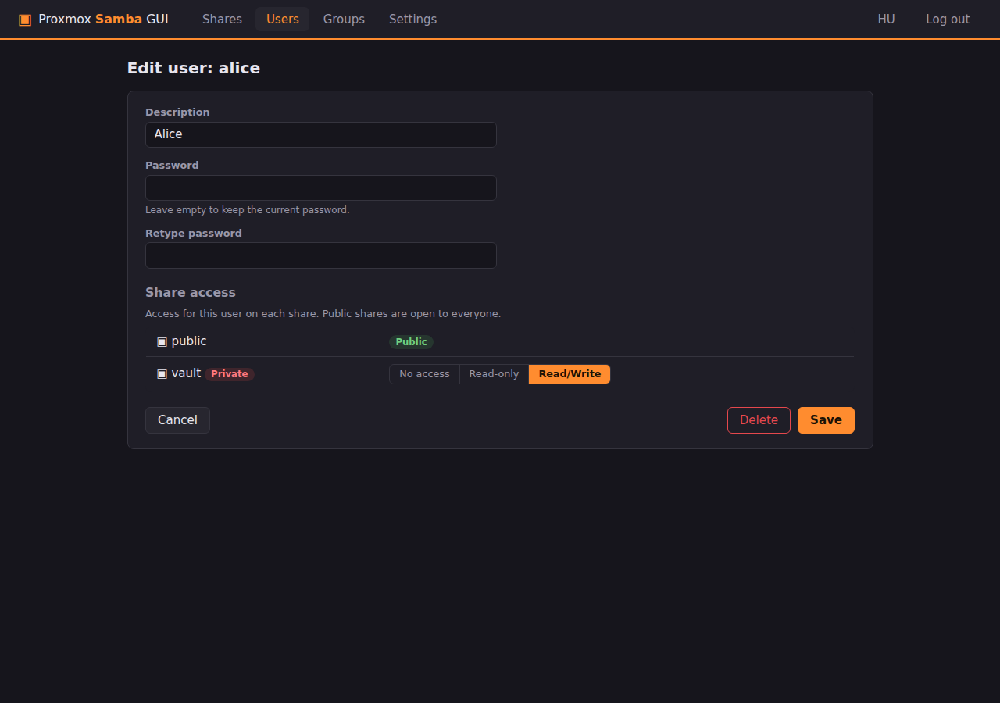
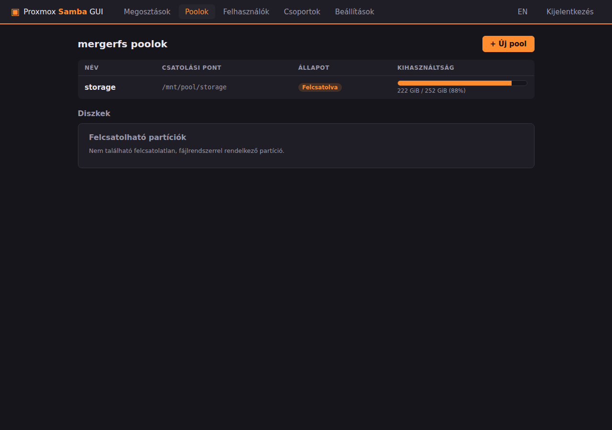
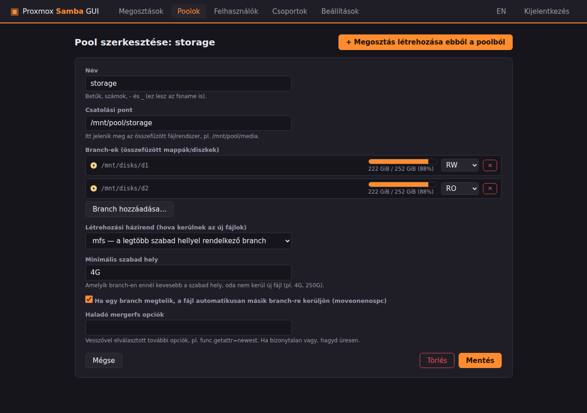

# Proxmox Samba GUI

Unraid-stílusú SMB (Samba) megosztás- és **mergerfs pool**-kezelő webes
felület Proxmox VE-hez. *(English summary below.)*

A Proxmox-ból hiányzik az Unraid kényelmes, kattintható Samba-kezelése. Ez a
projekt ezt pótolja: megosztásokat, felhasználókat és csoportokat hozhatsz
létre pár kattintással, az Unraidből ismert **Export** és **Security**
(Public / Secure / Private) modellel — kiegészítve csoportkezeléssel, amely
az Unraidben nincs is. Emellett [mergerfs](https://github.com/trapexit/mergerfs)
poolokat is kezel: több diszket/mappát fűzhetsz össze egyetlen nagy
fájlrendszerré (mint az Unraid array), és azt azonnal megoszthatod.



## Funkciók

- **Megosztások**: létrehozás/szerkesztés/törlés, útvonal-tallózóval;
  új mappa vagy **ZFS dataset** létrehozása közvetlenül a felületről
- **Export**: `Nem` / `Igen` / `Igen (rejtett)` — a rejtett megosztás működik,
  de nem látszik a hálózat tallózásakor
- **Biztonsági módok** (az Unraid pontos megfelelői):
  - **Publikus** — bárki, jelszó nélkül, írás/olvasás
  - **Védett (Secure)** — vendégek olvashatnak, írásjog felhasználónként /
    csoportonként adható (`write list`)
  - **Privát** — csak a kijelölt felhasználók/csoportok
    (`valid users` + `write list`)
- **Felhasználók**: rendszer- + Samba-felhasználó egy lépésben
  (`useradd` + `smbpasswd`), jelszóváltás, törléskor teljes takarítás
- **Csoportok**: POSIX csoportok tagságkezeléssel, a jogosultsági mátrixban
  `@csoport` néven
- **Jogosultsági mátrix mindkét irányból**: a megosztás oldalán a
  felhasználók/csoportok listája, a felhasználó/csoport oldalán a
  megosztások listája — ugyanaz az adat két nézetben
- **Lomtár** megosztásonként (`vfs_recycle`): a hálózatról törölt fájlok a
  `.Recycle.Bin`-be kerülnek, a felületről üríthető
- **Kétnyelvű felület** (magyar/angol, egy kattintással váltható)
- **PAM bejelentkezés** a hoszt root jelszavával, HTTPS-en

### mergerfs poolok

- **Pool létrehozás/szerkesztés**: branch-ek (diszkek/mappák) hozzáadása
  tallózóval vagy egy kattintással a kezelt diszk-mountokból, branch-enként
  RW / RO (csak olvasás) / NC (nincs új fájl) móddal
- **Diszkek felcsatolása** a felületről: a GUI listázza a fájlrendszerrel
  rendelkező, még nem csatolt partíciókat, és fstab-bejegyzéssel
  a `/mnt/disks/<név>` alá csatolja őket (formázást szándékosan nem végez)
- **Presetek + haladó mező**: create policy (mfs, epmfs, ff, pfrd, …) rövid
  magyarázatokkal, minimális szabad hely, `moveonenospc`, plusz szabad
  szöveges mező bármely további mergerfs opcióhoz
- **Kihasználtsági nézet**: pool- és branch-enkénti (diszkenkénti)
  tárhely-sávok, mint az Unraid Main füle
- **Élő átkonfigurálás**: felcsatolt pool esetén a branch-lista és a
  beállítások a mergerfs xattr-vezérlőjén át azonnal érvényre jutnak,
  újracsatolás nélkül — Samba-használat közben is bővíthető a pool
- **„Megosztás létrehozása ebből a poolból”** gomb: a share-szerkesztő a
  pool csatolási pontjával előtöltve nyílik
- **Törlésvédelem**: amíg egy megosztás a poolra mutat, a pool nem
  törölhető és nem választható le; pool törlésekor a branch-eken lévő
  adatok érintetlenek maradnak

| Megosztás szerkesztése | Felhasználó + jogosultsági mátrix (EN) |
|---|---|
|  |  |

| mergerfs poolok | Pool szerkesztése |
|---|---|
|  |  |

## Telepítés

Proxmox VE hoszton (vagy bármely Debian-alapú rendszeren, LXC-ben is), rootként:

```bash
git clone https://github.com/kzkz22/proxmox-samba-gui.git
cd proxmox-samba-gui
./deploy/install.sh
```

Ezután a felület a `https://<hoszt-ip>:8481/` címen érhető el, a belépés a
hoszt **root** jelszavával történik. (A tanúsítvány önaláírt, a böngésző
egyszer figyelmeztetni fog.)

## Hogyan működik?

- A beállítások *forrása* a `/etc/proxmox-samba-gui/state.json`, ebből
  generálódik determinisztikusan a `/etc/samba/proxmox-samba-gui.conf`.
- A meglévő `/etc/samba/smb.conf`-ot csak egyetlen `include` sorral egészíti
  ki (az eredetiről biztonsági mentés készül: `smb.conf.psg-backup`).
- Minden módosítás előtt `testparm` validálja a teljes új konfigurációt egy
  ideiglenes másolaton — hibás beállítás soha nem kerülhet a futó Samba alá.
- Sikeres validálás után újratöltés `smbcontrol all reload-config`-gal,
  újraindítás nélkül.
- A megosztott mappák adatkezelése Unraid-módra történik: a megosztás
  gyökere a `nobody` felhasználóé (`force user = nobody`), a hozzáférést a
  Samba szabályozza — így a jogosultsági mátrix módosítása sosem igényel
  fájlrendszer-szintű chown/chmod futtatást a meglévő fájlokon.
- Megosztás törlésekor **a lemezen lévő adatok érintetlenek maradnak**.
- A mergerfs poolokat generált **systemd unit** indítja
  (`/etc/systemd/system/psg-pool-<név>.service`, `RequiresMountsFor`-ral a
  helyes boot-sorrendhez) — szándékosan nem fstab-ból, mert a Debian 12-es
  mergerfs 2.33 mount-helpere elutasítja a generikus fstab-opciókat, a
  bináris közvetlen hívása viszont minden verzión működik. Egy hibás pool
  így sosem viszi emergency módba a hosztot.
- A diszk-mountok az `/etc/fstab`-ba kerülnek (`nofail`-lel), soronként
  `# psg:disk:<név>` címkével — csak a saját sorainkat módosítjuk, az első
  íráskor biztonsági mentés készül (`fstab.psg-backup`).

## Konfiguráció (környezeti változók)

| Változó | Alapértelmezés | Leírás |
|---|---|---|
| `PSG_ADMIN_USERS` | `root` | GUI-ba beléphető rendszerfelhasználók (vesszővel elválasztva) |
| `PSG_STATE_DIR` | `/etc/proxmox-samba-gui` | A state.json könyvtára |
| `PSG_SMB_CONF` | `/etc/samba/smb.conf` | A fő Samba konfig |
| `PSG_GEN_CONF` | `/etc/samba/proxmox-samba-gui.conf` | A generált konfig helye |
| `PSG_FSTAB` | `/etc/fstab` | A diszk-mountok fstab fájlja |
| `PSG_SYSTEMD_DIR` | `/etc/systemd/system` | A generált pool-unitok könyvtára |

## Fejlesztés

```bash
python3 -m venv venv && venv/bin/pip install -r backend/requirements-dev.txt
venv/bin/python -m pytest                   # egységtesztek
cd backend && ../venv/bin/uvicorn app.main:app --reload   # dev szerver
```

A `pytest` a repó gyökeréből fut; a `backend/` könyvtárat a `pyproject.toml`
teszi az import útvonalra.

---

## English summary

**Proxmox Samba GUI** is an Unraid-style web UI for managing Samba shares,
users and groups on a Proxmox VE host (or any Debian-based system / LXC).
It reproduces Unraid's Export (`No` / `Yes` / `Yes (hidden)`) and Security
(`Public` / `Secure` / `Private`) model with a per-user/per-group access
matrix, adds group management, a per-share recycle bin (`vfs_recycle`),
directory/ZFS-dataset creation from the browser dialog, PAM (root) login
over HTTPS, and a bilingual (Hungarian/English) interface.

It also manages [mergerfs](https://github.com/trapexit/mergerfs) pools:
mount existing partitions from the UI (fstab-based, no formatting), build
pools from disks/folders with per-branch RW/RO/NC modes, create-policy
presets plus a free-form advanced options field, per-branch usage bars,
live reconfiguration of mounted pools via the mergerfs xattr control
file, a "create share from this pool" shortcut, and deletion protection
while shares depend on a pool. Pools are started by generated systemd
units (`RequiresMountsFor` ordering) rather than fstab, which works on
both mergerfs 2.33 (Debian 12) and newer.

Install as root: `./deploy/install.sh`, then open `https://<host>:8481/`.
Configuration lives in `/etc/proxmox-samba-gui/state.json`; the generated
Samba config is validated with `testparm` before every apply, and the
existing `smb.conf` is only extended with a single `include` line.
